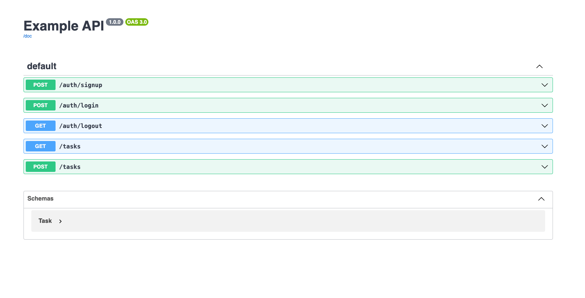

# Hono D1 API Example

A basic API using [Hono](https://github.com/honojs/hono) and [Cloudflare D1](https://developers.cloudflare.com/d1/). It includes:

- Basic email & password authentication with [Lucia](https://github.com/lucia-auth/lucia)
- Database management and ORM with [Drizzle](https://github.com/drizzle-team/drizzle-orm)
- OpenAPI spec and Swagger UI

## Screenshots

## Development

1. Clone the repository
1. Install dependencies: `npm install`
1. Initialize the database: `npm run db:migrate`
1. Start the development server: `npm run dev`
